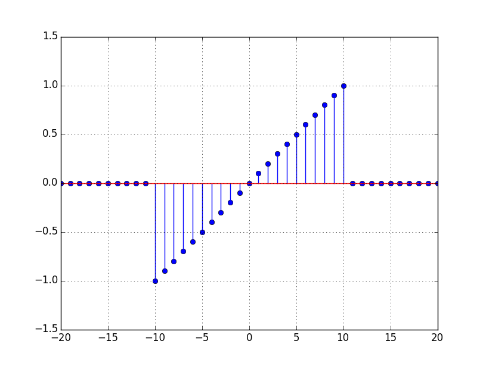
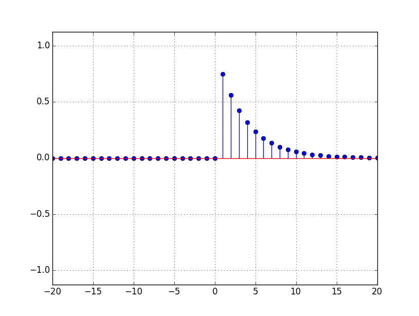
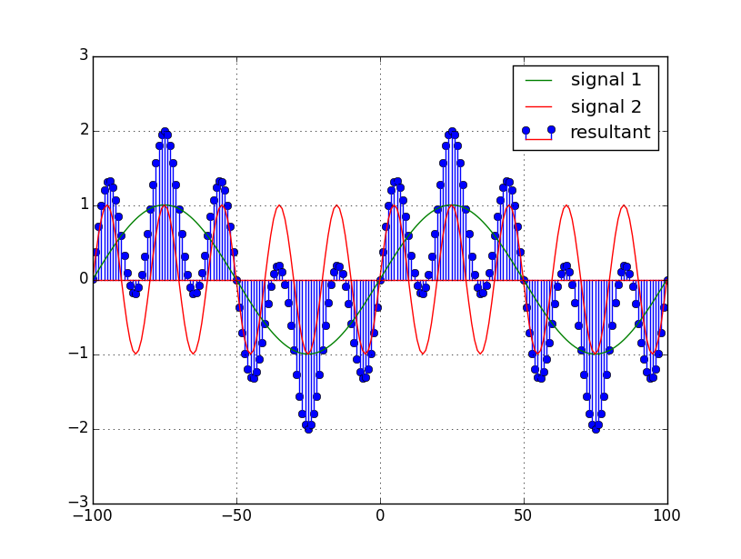
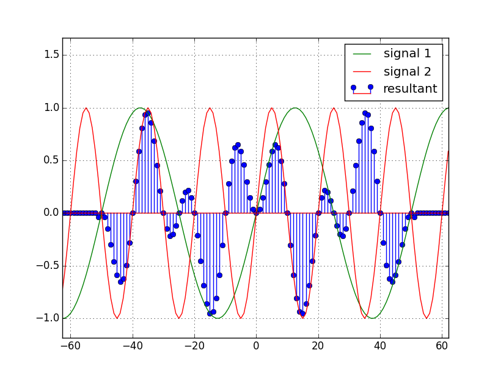
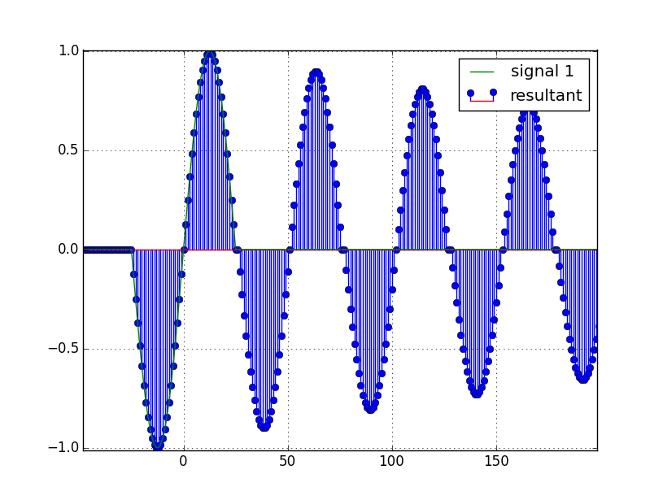
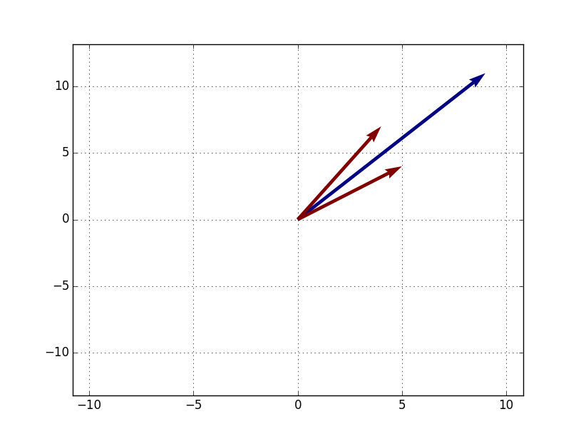

# dsp-tools
A host of utilities for digital signal processing and visualization built using _numpy_ and _matplotlib_ on Python.

## Modules:
* __Simple Signals__ - Contains code to generate and visualize simple digital signals. Eg.
Zero Mean Sawtooth:

Exponential Decay:

* __Basic Operations__ - Contains code to perform basic operations on signals. Eg.
Addition:

Inner Product:

Recursive Filter:

* __Vectors__ - Contains code to create, visualize and perform operations on vectors in two dimensions.(3D vectors support soon!) Eg.
Vector Addition:

## Note:
You may need to tweak some values like width, multiplier, window, frequency, amplitude to get your desired signal. Please bear with me while I come up with a GUI to make this easier.